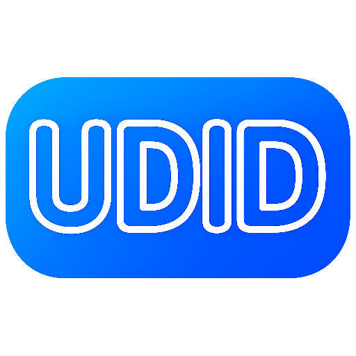
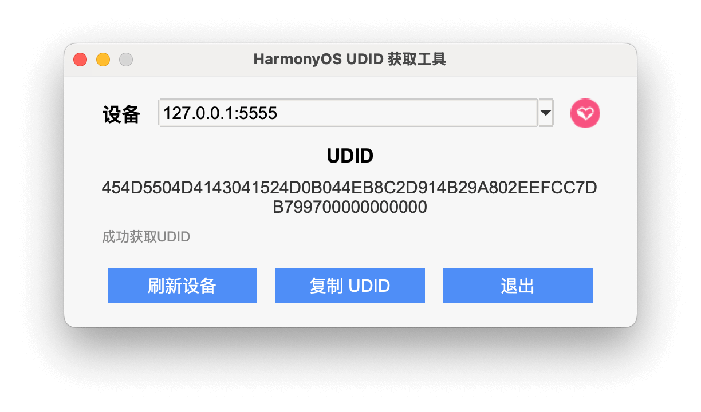

# HarmonyOS UDID 获取工具

<div align="center">



**一个简单易用的 HarmonyOS 设备 UDID 获取工具，帮助测试、产品等非开发者轻松获取鸿蒙设备的 UDID。**


[]()
[]()

</div>




## 📖 简介

HarmonyOS UDID 获取工具是一个跨平台的图形界面应用程序，专门用于获取 HarmonyOS 设备的 UDID。该工具基于华为官方的 HDC命令行工具，提供了友好的图形界面。

## 📁 项目结构

- `src/harmony_udid_tool/` - 应用程序源码
- `resources/` - HDC、图标和动态库等运行资源
- `scripts/` - 构建脚本
- `packaging/` - PyInstaller 配置
- `tests/` - 自动化测试

## ✨ 功能特性

-  **跨平台支持** - 支持 Windows、macOS 和 Linux 系统
-  **自动设备检测** - 自动扫描并列出连接的 HarmonyOS 设备
-  **一键复制** - 支持一键复制 UDID 到剪贴板
-  **实时刷新** - 支持实时刷新设备列表
-  **多设备支持** - 同时管理多个连接的设备
-  **安全可靠** - 基于华为官方 HDC 工具，安全可信

## 🚀 安装使用

### 普通用户：安装预编译版本
在 macOS 终端直接安装最新版本：

```sh
curl -fsSL https://raw.githubusercontent.com/iHongRen/harmony-udid-tool/main/install.sh | sh
```

或者：当前 [Releases](https://github.com/iHongRen/harmony-udid-tool/releases)  提供 macOS 版本，下载最新的 `.dmg` 文件，双击后将 `HarmonyOS-UDID-Tool.app` 拖入“应用程序”。

### 开发者：从源码运行

需要 Python 3.7+。在项目根目录执行：

macOS / Linux：

```sh
python3 main.py
```

Windows：

```powershell
python main.py
```

运行测试：

```sh
python3 -m pip install -r requirements-test.txt
pytest
```

Windows PowerShell：

```powershell
py -m pip install -r requirements-test.txt
py -m pytest
```

### 自行打包

先安装 PyInstaller：

```sh
python3 -m pip install pyinstaller
```

在 macOS 上执行：

```sh
python3 scripts/build_pyinstaller.py
```

脚本会自动检查依赖、清理旧的 `build/` 和 `dist/` 目录，并生成：

- `dist/HarmonyOS-UDID-Tool.app` - macOS 应用包
- `dist/HarmonyOS-UDID-Tool.dmg` - macOS 安装镜像

打包依赖 macOS 系统自带的 `hdiutil`。当前构建脚本会根据运行平台自动选择打包方式。

在 Windows 上，先安装 Python 3.7+，然后在项目根目录打开 PowerShell：

```powershell
py -m pip install pyinstaller
py scripts/build_pyinstaller.py
```

Windows 打包不需要 `hdiutil`，脚本会生成目录版程序：

- `dist/HarmonyOS-UDID-Tool/HarmonyOS-UDID-Tool.exe` - Windows 可执行文件

将整个 `dist/HarmonyOS-UDID-Tool/` 目录一起分发，不能只复制 `.exe` 文件，因为程序还需要目录中的运行库和资源文件。

## ℹ️ 使用说明

### 基本操作

1. **连接设备**
   - 使用 USB 数据线连接 HarmonyOS 设备到电脑
   - 确保设备已开启开发者模式和 USB 调试

2. **获取 UDID**
   - 启动应用程序
   - 点击"刷新设备"按钮扫描连接的设备
   - 从下拉列表中选择目标设备
   - UDID 将自动显示在文本框中

3. **复制 UDID**
   - 点击"复制 UDID"按钮
   - 或者右键点击 UDID 文本框选择复制

### 设备连接要求

- ✅ HarmonyOS 设备已连接到电脑
- ✅ 设备已开启开发者模式
- ✅ 设备已开启 USB 调试

## ❓ 常见问题

### Q: 为什么检测不到设备？

**A:** 请检查以下几点：
- 确保设备已正确连接到电脑
- 确认设备已开启开发者模式和 USB 调试
- 检查是否已授权电脑的连接请求
- 尝试重新连接设备或更换 USB 数据线

### Q: 如何开启 HarmonyOS 开发者模式？

**A:** 请按以下步骤开启：
1. 进入"设置" > "关于本机"
2. 连续点击"软件版本" 7 次
3. 返回"设置" > "系统" > "开发者选项"
4. 开启"USB 调试"

---
如果本项目对你有帮助，希望能给个 🌟Star， 给开发者一点反馈。